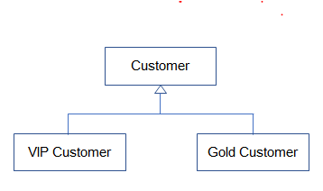

# 02. 상속을 활용한 멤버십 클래스 구현하기

## 멤버십 시나리오

    회사에서 고객 정보를 활용한 맞춤 서비스를 하기 위해 일반고객(Customer)과 
    이보다 충성도가 높은 우수고객(VIPCustomer)에 따른 서비스를 제공하고자 함

    물품을 구매 할때 적용되는 할인율과 적립되는 보너스 포인트의 비율이 다름 
    여러 멤버십에 대한 각각 다양한 서비스를 제공할 수 있음
    멤버십에 대한 구현을 클래스 상속을 활용하여 구현해보기

## 일반 고객(Customer) 클래스 구현

- 고객의 속성 : 고객 아이디, 고객 이름, 고객 등급, 보너스 포인트, 보너스 포인트 적립비율

- 일반 고객의 경우 물품 구매시 1%의 보너스 포인트 적립

```
package ch01;

public class Customer {

	private int customerID;
	private String customerName;
	private String customerGrade;
	int bonusPoint;
	double bonusRatio;
	
	public Customer() {
		customerGrade = "SILVER";
		bonusRatio = 0.01;
	}
	
	public int calcPrice(int price) {
		bonusPoint += price * bonusRatio;
		return price;
	}
	
	public String showCustomerInfo() {
		return customerName + "님의 등급은 " + customerGrade + 
				"이며, 보너스 포인트는" + bonusPoint + "입니다";
		
	}
}
```

## 우수 고객(VIPCustomer) 구현

    매출에 더 많은 기여를 하는 단골 고객

    제품을 살때 10%를 할인해 줌

    보너스 포인트는 제품 가격의 5%를 적립해 줌

    담당 전문 상담원이 배정됨

- Customer 클래스에 추가해서 구현하는 것은 좋지 않음

- VIPCustomer 클래스를 따로 구현

- 이미 Customer에 구현된 내용이 중복되므로 Customer를 확장하여 구현함(상속)

```
public class VIPCustomer extends Customer{

	private int agentID;
	double salesRatio;
	
	public VIPCustomer() {
		customerGrade = "VIP";    //오류 발생
		bonusRatio = 0.05;
		salesRatio = 0.1;
	}
	
	public int getAgentID() {
		return agentID;
	}
}
```


## protected 접근 제어자

- 상위 클래스에 선언된 private 멤버 변수는 하위 클래스에서 접근 할 수 없음

- 외부 클래스는 접근 할 수 없지만, 하위 클래스는 접근 할 수 있도록 protected 접근 제어자를 사용

Customer.java
```
	protected int customerID;
	protected String customerName;
	protected String customerGrade;

	//getter, setter 구현
	...
	public int getCustomerID() {
		return customerID;
	}

	public void setCustomerID(int customerID) {
		this.customerID = customerID;
	}

	public String getCustomerName() {
		return customerName;
	}

	public void setCustomerName(String customerName) {
		this.customerName = customerName;
	}

	public String getCustomerGrade() {
		return customerGrade;
	}

	public void setCustomerGrade(String customerGrade) {
		this.customerGrade = customerGrade;
	}

```


## Customer와 VIPCustomer 테스트하기

```
public class CustomerTest {

	public static void main(String[] args) {
		Customer customerLee = new Customer();
		customerLee.setCustomerName("이순신");
		customerLee.setCustomerID(10010);
		customerLee.bonusPoint = 1000;
		System.out.println(customerLee.showCustomerInfo());
			
			
		VIPCustomer customerKim = new VIPCustomer();
		customerKim.setCustomerName("김유신");
		customerKim.setCustomerID(10020);
		customerKim.bonusPoint = 10000;
		System.out.println(customerKim.showCustomerInfo());
	}
}
```