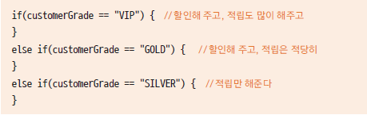

# 06. 다형성과 다형성을 사용하는 이유

## 다형성(polymorphism) 이란?

- 하나의 코드가 여러 자료형으로 구현되어 실행되는 것

- 같은 코드에서 여러 다른 실행 결과가 나옴

- 정보은닉, 상속과 더불어 객체지향 프로그래밍의 가장 큰 특징 중 하나임

- 다형성을 잘 활용하면 유연하고 확장성있고, 유지보수가 편리한 프로그램을 만들수 있음

## 다형성의 예

```
class Animal{
	
	public void move() {
		System.out.println("동물이 움직입니다.");
	}
	
	public void eating() {
		
	}
}

class Human extends Animal{
	public void move() {
		System.out.println("사람이 두발로 걷습니다.");
	}
	
	public void readBooks() {
		System.out.println("사람이 책을 읽습니다.");
	}
}

class Tiger extends Animal{
	
	public void move() {
		System.out.println("호랑이가 네 발로 뜁니다.");
	}
	
	public void hunting() {
		System.out.println("호랑이가 사냥을 합니다.");
	}
}


class Eagle extends Animal{
	public void move() {
		System.out.println("독수리가 하늘을 날아갑니다.");
	}
	
	public void flying() {
		System.out.println("독수리가 날개를 쭉 펴고 멀리 날아갑니다");
	}
}


public class AnimalTest {

	public static void main(String[] args) {

		Animal hAnimal = new Human();
		Animal tAnimal = new Tiger();
		Animal eAnimal = new Eagle();
		
		AnimalTest test = new AnimalTest();
		test.moveAnimal(hAnimal);
		test.moveAnimal(tAnimal);
		test.moveAnimal(eAnimal);
		
		ArrayList<Animal> animalList = new ArrayList<Animal>();
		animalList.add(hAnimal);
		animalList.add(tAnimal);
		animalList.add(eAnimal);
		
		for(Animal animal : animalList) {
			animal.move();
		}
	}	
	
	public void moveAnimal(Animal animal) {
		animal.move();
		
	}
}
```

## 다형성을 사용하는 이유?

- 다른 동물을 추가하는 경우

- 상속과 메서드 재정의를 활용하여 확장성 있는 프로그램을 만들 수 있음

- 그렇지 않는 경우 많은 if-else if문이 구현되고 코드의 유지보수가 어려워짐



- 상위 클래스에서는 공통적인 부분을 제공하고 하위 클래스에서는 각 클래스에 맞는 기능 구현

- 여러 클래스를 하나의 타입(상위 클래스)으로 핸들링 할 수 있음