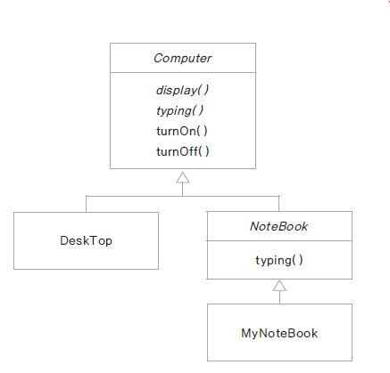

# 09. 추상 클래스(abstract class) 구현하기

## 추상 클래스란?

- 구현 코드 없이 메서드의 선언만 있는 추상 메서드(abstract method)를 포함한 클래스

- 메서드 선언(declaration) : 반환타입, 메서드 이름, 매개변수로 구성

- 메서드 정의(definition) : 메서드 구현(implementation)과 동일한 의미 구현부(body) 를 가짐 ({ })

- 예) int add(int x, int y); // 선언 <br>
&nbsp;&nbsp;&nbsp;int add(int x, int y){ } // 구현부가 있음, 추상 메서드 아님

- abstract 예약어를 사용

- 추상 클래스는 new 할 수 없음 ( 인스턴스화 할 수 없음 )

## 추상 클래스 구현하기

- 메서드에 구현 코드가 없으면 abstract 로 선언

- abstract로 선언된 메서드를 가진 클래스는 abstract로 선언

- 모든 메서드가 구현 된 클래스라도 abstract로 선언되면 추상 클래스로 인스턴스화 할 수 없음

- 추상 클래스의 추상 메서드는 하위 클래스가 상속 하여 구현

- 추상 클래스 내의 추상 메서드 : 하위 클래스가 구현해야 하는 메서드

- 추상 클래스 내의 구현 된 메서드 : 하위 클래스가 공통으로 사용하는 메서드 ( 필요에 따라 하위 클래스에서 재정의 함 )

- 예제 구현하기



Computer.java
```
public abstract class  Computer {

	abstract void display();
	abstract void typing();
	
	public void turnOn() {
		System.out.println("전원을 켭니다.");
	}
	
	public void turnOff() {
		System.out.println("전원을 끕니다.");
	}
}
```

DeskTop.java
```
public class DeskTop extends Computer{

	@Override
	void display() {
		System.out.println("DeskTop display");
	}

	@Override
	void typing() {
		System.out.println("DeskTop typing");
	}

	@Override
	public void turnOff() {
		System.out.println("Desktop turnoff");
	}
}
```

NoteBook.java
```
public abstract class NoteBook extends Computer{
	@Override
	public void typing() {
		System.out.println("NoteBook typing");		
	}
}
```

MyNoteBook.java
```
public class MyNoteBook extends NoteBook{

	@Override
	void display() {
		System.out.println("MyNoteBook display");		
	}
}
```

ComputerTest.java
```
public class ComputerTest {

	public static void main(String[] args) {
		Computer computer = new DeskTop();
		computer.display();
		computer.turnOff();
		
		NoteBook myNote = new MyNoteBook();
	}
}
```