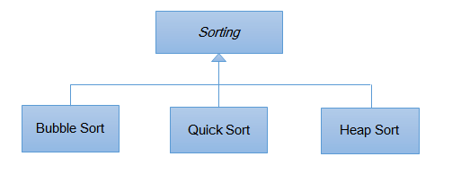
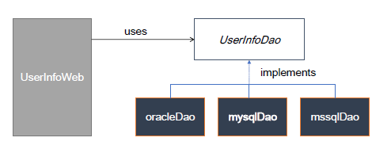
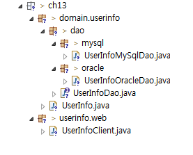
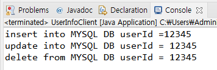
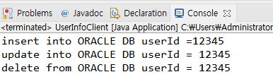

# 13 인터페이스를 활용한 다형성 구현 (dao 구현하기)

## 인터페이스와 다형성

- 하나의 인터페이스를 여러 객체가 구현하게 되면 클라이언트 프로그램은 인터페이스의 메서드를 활용하여 여러 객체의 구현을 사용할 수 있음 ( 다형성)

- 여러가지 예





## 인터페이스를 활용한 dao 구현하기

- DB에 회원 정보를 넣는 dao(data access object)를 여러 DB 제품이 지원될 수 있게 구현함

- 환경파일(db.properties) 에서 database의 종류에 대한 정보를 읽고 그 정보에 맞게 dao 인스턴스를 생성하여 실행될 수 있게 함

- source hierachy



UserInfo.java (사용자 정보 클래스)
```
public class UserInfo {
	
	private String userId;
	private String passwd;
	private String userName;
	
	public String getUserId() {
		return userId;
	}
	
	public void setUserId(String userId) {
		this.userId = userId;
	}
	
	public String getPasswd() {
		return passwd;
	}
	
	public void setPasswd(String passwd) {
		this.passwd = passwd;
	}
	
	public String getUserName() {
		return userName;
	}
	
	public void setUserName(String userName) {
		this.userName = userName;
	}
}
```

UserInfoDao.java ( dao 에서 제공되어야 할 메서드를 선언한 인터페이스 )
```
public interface UserInfoDao {

	void insertUserInfo(UserInfo userInfo);
	void updateUserInfo(UserInfo userInfo);
	void deleteUserInf(UserInfo userInfo);
}
```

UserInfoMySqlDao.java (UserInfoDao 인터페이스를 구현한 MySql 버전 dao)
```
public class UserInfoMySqlDao implements UserInfoDao{

	@Override
	public void insertUserInfo(UserInfo userInfo) {
		System.out.println("insert into MYSQL DB userId =" + userInfo.getUserId() );		
	}

	@Override
	public void updateUserInfo(UserInfo userInfo) {
		System.out.println("update into MYSQL DB userId = " + userInfo.getUserId());		
	}

	@Override
	public void deleteUserInf(UserInfo userInfo) {
		System.out.println("delete from MYSQL DB userId = " + userInfo.getUserId());
		
	}

}
```

UserInfoOracleDao.java (UserInfoDao 인터페이스를 구현한 Oracle 버전 dao)
```
public class UserInfoOracleDao implements UserInfoDao{

	public void insertUserInfo(UserInfo userInfo){
		System.out.println("insert into ORACLE DB userId =" + userInfo.getUserId() );
	}
	
	public void updateUserInfo(UserInfo userInfo){
		System.out.println("update into ORACLE DB userId = " + userInfo.getUserId());
	}
	
	public void deleteUserInf(UserInfo userInfo){
		System.out.println("delete from ORACLE DB userId = " + userInfo.getUserId());
	}
}
```

UserInfoClient.java (UserInfoDao 인터페이스를 활용하는 클라이언트 프로그램)
```
public class UserInfoClient {

	public static void main(String[] args) throws IOException {

		FileInputStream fis = new FileInputStream("db.properties");
		
		Properties prop = new Properties();
		prop.load(fis);
		
		String dbType = prop.getProperty("DBTYPE");
		
		UserInfo userInfo = new UserInfo();
		userInfo.setUserId("12345");
		userInfo.setPasswd("!@#$%");
		userInfo.setUserName("이순신");
		
		
		UserInfoDao userInfoDao = null;
		
		if(dbType.equals("ORACLE")){
			userInfoDao = new UserInfoOracleDao();
		}
		else if(dbType.endsWith("MYSQL")){
			userInfoDao = new UserInfoMySqlDao();
		}
		else{
			System.out.println("db support error");
			return;
		}
		
		userInfoDao.insertUserInfo(userInfo);
		userInfoDao.updateUserInfo(userInfo);
		userInfoDao.deleteUserInf(userInfo);
	}
}
```

db.properties 환경파일이 MYSQL 일때
```
DBTYPE=MYSQL
```
실행결과 


db.properties 환경파일이 ORACLE 일때
```
DBTYPE=ORACLE
```
실행결과 
