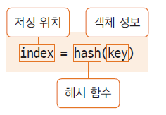

# 02. Object 클래스의 메서드 활용

## equals() 메서드

- 두 인스턴스의 주소 값을 비교하여 true/false를 반환

- 재정의 하여 두 인스턴스가 논리적으로 동일함의 여부를 구현함

- 인스턴스가 다르더라도 논리적으로 동일한 경우 true를 반환하도록 재정의 할 수 있음

  (같은 학번, 같은 사번, 같은 아이디의 회원...)
  
## hashCode() 메서드

- hashCode()는 인스턴스의 저장 주소를 반환함

- 힙메모리에 인스턴스가 저장되는 방식이 hash 방식

- hash : 정보를 저장, 검색하는 자료구조

- 자료의 특정 값(키 값)에 대한 저장 위치를 반환해주는 해시 함수를 사용



- 두 인스턴스가 같다는 것은?

  두 인스턴스에 대한 equals()의 반환 값이 true
  동일한 hashCode() 값을 반환

- 논리적으로 동일함을 위해 equals() 메서드를 재정의 하였다면 hashCode()메서드도 재정의 하여 동일한 hashCode 값이 반환되도록 한다

Student.java
```
public class Student {

	private int studentId;
	private String studentName;

	public Student(int studentId, String studentName)
	{
		this.studentId = studentId;
		this.studentName = studentName;
	}
	
	public boolean equals(Object obj) {
		if( obj instanceof Student) {
			Student std = (Student)obj;
			if(this.studentId == std.studentId )
				return true;
			else return false;
		}
		return false;
		
	}
	
	@Override
	public int hashCode() {
		return studentId;
	}
}
```

EqualTest.java
```
public class EqualTest {

	public static void main(String[] args) {
		Student Lee = new Student(100, "Lee");
		Student Lee2 = Lee;
		Student Shun = new Student(100, "Lee");
		
		System.out.println(Lee == Shun);
		System.out.println(Lee.equals(Shun));
		
		System.out.println(Lee.hashCode());
		System.out.println(Shun.hashCode());
		
		
		Integer i1 = new Integer(100);
		Integer i2 = new Integer(100);
		
		System.out.println(i1.equals(i2));
		System.out.println(i1.hashCode());
		System.out.println(i2.hashCode());
		
		System.out.println(System.identityHashCode(i1));
		System.out.println(System.identityHashCode(i2));

	}
}
```

## clone() 메서드

- 객체의 원본을 복제하는데 사용하는 메서드

- 생성과정의 복잡한 과정을 반복하지 않고 복제 할 수 있음

- clone()메서드를 사용하면 객체의 정보(멤버 변수 값등...)가 동일한 또 다른 인스턴스가 생성되는 것이므로, 객체 지향 프로그램에서의 정보 은닉, 객체 보호의 관점에서 위배될 수 있음

- 해당 클래스의 clone() 메서드의 사용을 허용한다는 의미로 cloneable 인터페이스를 명시해 줌

Student.java
```
public class Student implements Cloneable{

    .......

	@Override
	protected Object clone() throws CloneNotSupportedException {
		// TODO Auto-generated method stub
		return super.clone();
	}
}
```

EqualTest.java
```
    Student Lee3 = (Student)Lee.clone();
	System.out.println(System.identityHashCode(Lee));
	System.out.println(System.identityHashCode(Lee3));
		
```		


