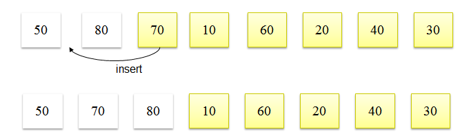
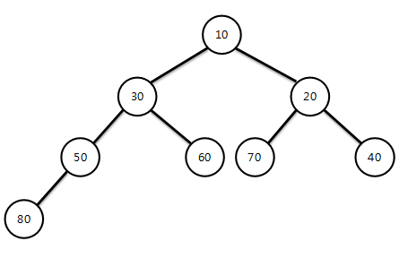

# 03. 정렬 알고리즘

## 평균 수행 시간이 O(n^2)인 알고리즘

- 버블 정렬(Bubble Sort), 삽입 정렬(Insertion Sort), 선택 정렬(Selection Sort)

- 각 요소가 다른 요소와 평균 한번 이상씩 비교를 하여 정렬 됨

### Insertion Sort 구현해보기

- Insertion Sort의 기본 개념은 이미 정렬된 상태의 요소에 새로운 요소를 추가할 때 정렬하여 추가하는 개념이다.(손안의 카드)

- 두 번째 요소 부터 이전 요소들과 비교하면서 insert 될 위치를 찾아가며 정렬하는 알고리즘



```
public class InsertionSort {

	public static void insertionSort(int[] arr, int count) {
		
		int i = 0, j = 0;
		int temp = 0;

		for(i = 1; i < count; i++) {
			temp = arr[i];
			j = i;
			while((j > 0) && arr[j-1] > temp) {
				arr[j] = arr[j-1];
				j = j - 1;
			}
			arr[j] = temp;

			System.out.println("반복 -" + i);
			printSort(arr, count);
		}
		
	}
	
	public static void printSort(int value[], int count)
	{
		int i = 0;
		for(i = 0; i < count; i++) {
			System.out.print(value[i] + "\t");
		}
		System.out.println();
	}
	
	public static void main(String[] args) {
		
		int[] arr = {80, 50, 70, 10, 60, 20, 40, 30 };
		
		insertionSort(arr, 8);
	}

}
```


## 평균 수행 시간이 O(logN)인 알고리즘

- 퀵 정렬(Quick Sort), 병합 정렬(Merge Sort), 힙 정렬(Heap Sort)

- 한번 수행될 때마다 정렬되어야 하는 수의 범위가 1/2로 줄어드는 경우

- 퀵 정렬 이외의 다른 알고리즘은 추가적인 메모리가 필요함

### Heap Sort 구현해보기



```
public class HeapSort {

	private int SIZE;
	private int heapArr[];
	
	public HeapSort()
	{
		SIZE = 0;
		heapArr = new int [50];
	}
	
	public void insertHeap(int input)
	{
		int i = ++SIZE;
		//while(( i != 1) && ( input > heapArr[i/2])){ //max heap
		while(( i != 1) && ( input < heapArr[i/2])){ //min heap
			heapArr[i] = heapArr[i/2];
			i = i/2;
		}
		heapArr[i] = input;
	}
	
	public int getHeapSize()
	{
		return SIZE;
	}
	
	public int deleteHeap()
	{
		int parent, child;
		int data, temp;
		data = heapArr[1]; 
		
		temp = heapArr[SIZE]; 
		SIZE -= 1; 
		parent =1; child = 2;
		
		while(child <= SIZE){
			//if((child < HEAP_SIZE) && (heapArr[child] < heapArr[child+1])){ //max heap
			if((child < SIZE) && (heapArr[child] > heapArr[child+1])){ //min heap
				child++;
			}
			//if(temp >= heapArr[child]) break; //max heap
			if(temp <= heapArr[child]) break;   //min heap
			heapArr[parent] = heapArr[child];
			parent = child;
			child *= 2;
		}
		
		heapArr[parent] = temp;
		return data;
	}
	
	public void printHeap(){
		//System.out.printf("\n Max Heap : ");
		System.out.printf("\n Min Heap : ");
		for(int i=1; i<=SIZE; i++)
			System.out.printf("[%d] ", heapArr[i]);
	}
	public static void main(String[] args) {
		HeapSort h = new HeapSort();
		h.insertHeap(80);
		h.insertHeap(50);
		h.insertHeap(70);
		h.insertHeap(10);
		h.insertHeap(60);
		h.insertHeap(20);
		
		h.printHeap();
	
		int n, data;
		n = h.getHeapSize();
		for(int i=1; i<=n; i++){    
			data = h.deleteHeap();  
			System.out.printf("\n 출력 : [%d]", data);
		}
	}
}
```

