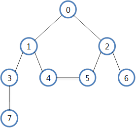

# 04. DFS(Depth - First Search)와 BFS(Breadth - First Search)

## 그래프 탐색



### 그래프를 matrix로 표현하기

```
public class UndirectedGraph{
    private int count;            
    private int[][] vertexMatrix;  
    
    
    public UndirectedGraph(int count){
        this.count = count;
        vertexMatrix = new int[count][count];
    }

    public void addEdges(int from, int to, int weight){
    	vertexMatrix[from][to] = weight;
    	vertexMatrix[to][from] = weight;
    }
    
    public int[][] getMatrix(){
    	return vertexMatrix;
    }
}
```

### 깊이 우선 탐색(DFS)

- 인접한 노드를 우선 탐색 하는 방식

- 스택을 활용하여 구현할 수 있음

- DFS 탐색 순서 : 
 0 - 1 - 3 - 7 - 4 - 5 - 2 - 6 or 
 0 - 2 - 6 - 5 - 4 - 1 - 3 - 7     

```
public class DfsSearch {

	int count;
	boolean[] visited;
	Stack<Integer> stack;
	int[][] matrix;
	
	public DfsSearch(int count){
		this.count = count;
		visited = new boolean[count];
		stack = new Stack<Integer>();
	}
	
	public void dfsTraversal() {
	
		stack.push(0);
		visited[0] = true;
		
		while(stack.size() != 0) {
			int node = stack.pop();
			
			System.out.print(node + "  ");
			
			for(int j = 0; j<count; j++) {
				if(matrix[node][j] != 0 && !visited[j] ) {
					stack.push(j);
					visited[j] = true;
				}
			}
			
		}
	}
	
	public static void main(String[] args) {

		int count = 8;
		UndirectedGraph graph = new UndirectedGraph(count);
		DfsSearch dfsSearch = new DfsSearch(count);
		
		graph.addEdges(0, 1, 1);
		graph.addEdges(0, 2, 1);
		graph.addEdges(1, 3, 1);
		graph.addEdges(1, 4, 1);
		graph.addEdges(2, 5, 1);
		graph.addEdges(2, 6, 1);
		graph.addEdges(4, 5, 1);
		graph.addEdges(3, 7, 1);
		
		dfsSearch.matrix = graph.getMatrix();
		dfsSearch.dsfTraversal();
			
	}
}
```

### 너비 우선 탐색(BFS)

- 한 노들에 모든 인접한 노드를 탐색하는 방식

- 큐를 활용하여 구현할 수 있음

- BFS 탐색 순서 : 0 - 1 - 2 - 3 - 4 - 5 - 6 - 7

```
public class BfsSearch {

	int count;
	boolean[] visited;
	ArrayList<Integer> queue;
	int[][] matrix;
	
	public BfsSearch(int count){
		this.count = count;
		visited = new boolean[count];
		queue = new ArrayList<Integer>();
	}
	
	public void bfsTraversal() {
	
		queue.add(0);
		visited[0] = true;
		
		while(queue.size() != 0) {
			int node = queue.remove(0);
			
			System.out.print(node + "  ");
			
			for(int j = 0; j<count; j++) {
				if(matrix[node][j] != 0 && !visited[j] ) {
					queue.add(j);
					visited[j] = true;
				}
			}
			
		}
	}
	
	public static void main(String[] args) {

		int count = 8;
		UndirectedGraph graph = new UndirectedGraph(count);
		BfsSearch bfsSearch = new BfsSearch(count);
		
		graph.addEdges(0, 1, 1);
		graph.addEdges(0, 2, 1);
		graph.addEdges(1, 3, 1);
		graph.addEdges(1, 4, 1);
		graph.addEdges(2, 5, 1);
		graph.addEdges(2, 6, 1);
		graph.addEdges(4, 5, 1);
		graph.addEdges(3, 7, 1);
		
		bfsSearch.matrix = graph.getMatrix();
		bfsSearch.bfsTraversal();
			
	}
}
```
