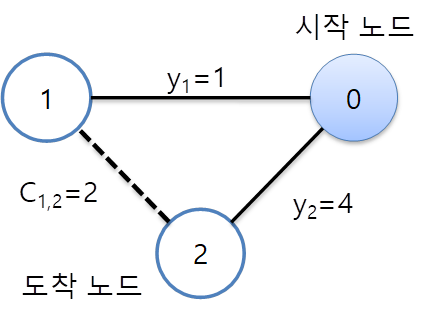
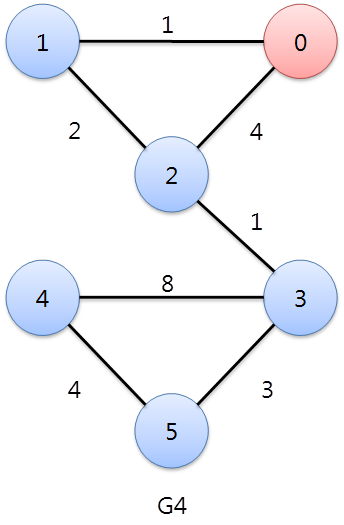

# 05. 최단거리 구하기 문제






## 문제 풀이

- 모든 노드 중 연결된 최단거리를 가진 노드를 찾아서

- 노드 v에 인접한 노드 w 에 대해 다음 조건이 성립하면 w 에 대한 최단 거리를 업데이트 한다

  (즉 원래 w로 가던 거리보다 v를 거쳐 가는 거리가 더 가까우면 w로 가는 거리는 v를 거쳐가는 것으로 최단 거리를 수정)

  Yw = Yv + Cvw if Yv + Cvw < Yw    
```
class MyGraph{
    private int count;   //노드 수           
    private int[][] vertexMatrix;  // matrix로 그래프 표시
    private int[] distance;        // 특정 노드에 대한 각 노드의 최단 거리
    private boolean[] visited;     // alread visited???
    private static int UNLIMIT = 999999999;  // 초기값 
    
    public MyGraph(int count){
        this.count = count;
        vertexMatrix = new int[count][count];
        distance = new int[count];
        visited = new boolean[count];
         
    }
    public void addEdges(int from, int to, int weight){
    	vertexMatrix[from][to] = weight;
    	vertexMatrix[to][from] = weight;
    }
 
    public void calcShotestPath(int from){
         
        for(int i=0;i<count;i++){
            distance[i] = UNLIMIT;
        }
        
        visited[from] = true;
        distance[from] = 0;
        //연결노드 distance갱신
        for(int i= 0; i<count; i++){
            if(visited[from] && vertexMatrix[from][i] !=0){
                distance[i] = vertexMatrix[from][i];
            }
        }
         
        for(int k =0; k<count-1; k++){

            int min=UNLIMIT;
            int minIndex= -1;
            
            for(int i = 0; i< count ;i++){
                if(!visited[i] && distance[i]!=UNLIMIT){
                    if(distance[i] < min ){
                        min = distance[i];
                        minIndex = i;
                    }
                }
            }
            
            visited[minIndex] = true;
            for(int i=0; i<count; i++){
                if(!visited[i] && vertexMatrix[minIndex][i]!=0){
                    if(distance[i]>distance[minIndex]+vertexMatrix[minIndex][i]){
                        distance[i] = distance[minIndex]+vertexMatrix[minIndex][i];
                    }
                }
            }
 
        }
    }
    
    public void showDistance(int from) {
    	
    	for(int i = 0; i<count; i++) {
    		
    		System.out.println(from + " 노드로부터 " + i + " 노드의 최단 거리는 : " + distance[i]);
    	}
    }
}


public class ShortestPath {

	public static void main(String[] args) {
		MyGraph graph = new MyGraph(6);
		graph.addEdges(0, 1, 1);
		graph.addEdges(0, 2, 4);
		graph.addEdges(1, 2, 2);
		graph.addEdges(2, 3, 1);
		graph.addEdges(3, 4, 8);
		graph.addEdges(3, 5, 3);
		graph.addEdges(4, 5, 4);

		graph.calcShotestPath(0);
		graph.showDistance(0);

	}
}
```
