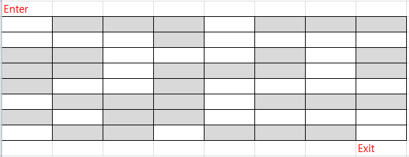
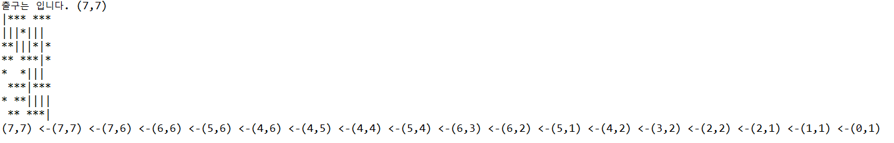

# 06. 미로 찾기 문제

- 입구에서 출구로 통하는 길을 찾는 미로 찾기 문제

- 스택을 활용하여 문제를 해결할 수 있음

- 출구 탐색을 위해 BFS나 DFS로 해결할 수 있음

- 아래 그림에서 Enter 에서 Exit을 찾아가는 path의 좌표를 출력하세요

- 움직 일 수 있는 방향의 예: ( 2,2 ) 위치에서 볼 수 있는 도달 가능 위치는  N(2,1), E(3,2), S(2,3), W(1,2) 



- 하나의 위치를 방문할때마다 stack에 위치를 저장한다. (push)

- 저장된 위치에서 더 이상 갈 곳이 없는 경우 되돌아 간다. ( pop )

- stack에서 꺼낸 위치에서 가지 않은 곳을 찾아 간다.

### 미로 정의 

```
public class Maze {

	public int[][] myMaze ={
			{0, 1, 1, 1, 0, 1, 1, 1},
			{0, 0, 0, 1, 0, 0, 0, 0},
			{1, 1, 0, 0, 0, 1, 0, 1},
			{1, 1, 0, 1, 1, 1, 0, 1},
			{1, 0, 0, 1, 0, 0, 0, 0},
			{0, 1, 1, 1, 0, 1, 1, 1},
			{1, 0, 1, 1, 0, 0, 0, 0},
			{0, 1, 1, 0, 1, 1, 1, 0}

	};
}
```

### 움직이는 위치 

```
public class Move {

	int direction=0;
	
	public int x=0;
	public int y=0;
	
	public Move(int x,int y){
		this.x = x;
		this.y = y;
		
	}
	
}
```

### 움직임을 표시할 변수들 (Robot.java)

```
    public static int NUMDIRECTIONS =  4;
	public static int WIDTH = 8;
	public static int HEIGHT = 8;
	
	Stack<Move> stack = new Stack<Move>();
	Move Move;
	Maze maze = new Maze();
	
	public int[][] DIRECTION_OFFSETS = 
	{
		{0, -1},		// 위쪽으로 이동.
		{1, 0},			// 오른쪽으로 이동.
		{0, 1},			// 아래쪽으로 이동.
		{-1, 0}			// 왼쪽으로 이동.
	};
	
	public static int NOTVISIT = 0;
	public static int WALL = 1;
	public static int VISIT = 2;
	int[][] markArray = new int[8][8];
```

### 출구를 찾아라 (Robot.java)

```
public void findPath( int startX, int startY, int endX, int endY) {
		
		boolean isEmpty = false; 
		boolean isFound = false;
		int i = 0;

		Move start = new Move(startX, startY);

		start.direction = 0;
		stack.push(start);
		
		while(isEmpty == false && isFound == false) {
			
				Move curPos = stack.pop();
				int x = curPos.x;
				int y = curPos.y;
				int direction = curPos.direction;

				while(isFound == false && direction < NUMDIRECTIONS) {
				
					int newX = x + DIRECTION_OFFSETS[direction][0];
					int newY = y + DIRECTION_OFFSETS[direction][1];

					if (newX >= 0 && newX < WIDTH
								&& newY >= 0 && newY < HEIGHT
								&& maze.myMaze[newY][newX] == NOTVISIT
								&& markArray[newY][newX] == NOTVISIT) {										
						Move newPosition = new Move(newX, newY);
						newPosition.direction = direction + 1;
						stack.push(newPosition);
						markArray[y][x] = VISIT;

						x = newX;
						y = newY;
						direction = 0;

						if (newX == endX && newY == endY) {
							isFound = true;
							newPosition.x = newX;
							newPosition.y = newY;
							newPosition.direction = 0;
							stack.push(newPosition);
							markArray[newY][newX] = VISIT;
						}
					}
					else direction++;
				}//end-of-while
			isEmpty = stack.isEmpty();
		}//end-of-while
	}
```

### 찾은 길 출력하기 (Robot.java)

```
public void showPath() {
		int[][] resultArray = new int[8][8];
		boolean isEmpty = false;
		
		
		for(int i = 0; i < HEIGHT; i++) {
			for(int j = 0; j < WIDTH; j++) {
				resultArray[i][j] = maze.myMaze[i][j];
			}
		}
		
		
		for(int i = 0; i < HEIGHT; i++) {
			for(int j = 0; j < WIDTH; j++) {
				if (maze.myMaze[i][j] == WALL) {
					System.out.print("*");
				}
				else if (markArray[i][j] == VISIT) {
					System.out.print("|");
				}
				else {
					System.out.print(" ");
				}
			}
			System.out.print("\n");
		}
		
		
		
		int i = 0;
		while(isEmpty == false) {
			Move move = stack.pop();
			int x = move.x;
			int y = move.y;
			resultArray[y][x] = VISIT;

			if (i > 0) {
				System.out.print("<-");
			}
			System.out.print("(" + x +"," + y + ") ");
			i++;
			isEmpty = stack.isEmpty();
		}
		System.out.println();
	}
```

### 실행하기
```
public class MazeTest {

	public static void main(String[] args) {
		
		Robot robot;
		System.out.println("출구는 입니다. (7,7)");
		
		robot = new Robot();	
				
		robot.findPath( 0,0, 7,7);
		robot.showPath();
		
	}
}
```


